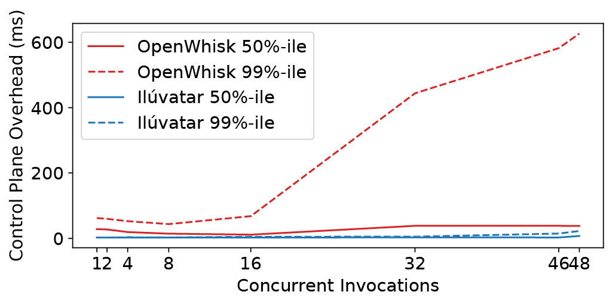

# Ilúvatar

Ilúvatar is an open Serverless platform built with the goal of jumpstarting and streamlining FaaS research.
It provides a system that is easy and consistent to use, highly modifiable, and directly reports experimental results.


## Try it Out

```sh
# Dependencies
sudo apt-get install -y curl runc bridge-utils iptables net-tools sysstat containerd jq pkg-config cmake gcc g++ libssl-dev pkg-config libprotobuf-dev
# Rust, more at https://www.rust-lang.org/tools/install
curl --proto '=https' --tlsv1.2 -sSf https://sh.rustup.rs | sh

# Install non-apt dependencies and build Ilúvatar, assumes python3 exists
cd src/Ilúvatar/docs/examples
./sample_setup.sh
sudo ./target/debug/ilúvatar_worker -c ilúvatar_worker/src/worker.dev.json &
worker_pid=$(echo $!)
```

Register a function with the worker.

```sh
../../target/debug/ilúvatar_worker_cli --address "127.0.0.1" --port 8079 register --name "hello" --version 1 --image "docker.io/alfuerst/hello-iluvatar-action:latest" --memory 128 --cpu 1
```

Invoke the newly registered function, passing custom arguments.

```sh
../../target/debug/ilúvatar_worker_cli --address "127.0.0.1" --port 8079 invoke --name "hello" --version 1 -a name=`whoami`
```

Kill the worker running in the background.

```sh
sudo kill --signal SIGINT $worker_pid
```

You can run more advanced scenarios [here](./src/Il%C3%BAvatar/docs/examples/README.md).

## Why use Ilúvatar?

Ilúvatar provides the features and guarantees we find to be necessary to conduct high-quality, reproducible, and open research.

1. Load generation a first-class citizen of the system, making results easier to capture and analyze.
2. Fast, predictable, jitter-resistant function execution for reliable and repeatable experimentation.
3. An architecture designed to allow testing on a single worker node, or a cluster of load-balanced nodes.
4. The ability to run a load scenario on a live system or as a simulation, _using the same codebase_.
5. An extendible FaaS platform built for an open-source research community.

Details about the implementation can be found in the paper below.
How to use the various features and jump-starting your research can be found [in the Ilúvatar documentation](./src/Il%C3%BAvatar/README.md).

A popular open-source platform used in research is OpenWhisk, but we have found it has high overheads under notable load, caused by a variety of factors.
The scalability of OpenWhisk vs our Ilúvatar can be seen here.



We can ensure a constant 1-3 ms overhead on invocations at significant load, whereas OpenWhisk sees high and variable overheads, on the same hardware.
It also does not have the reasearch-first features implemented in Ilúvatar.

## More documentation

Detailed documentation can be found [here](./src/Ilúvatar/README.md).
Ilúvatar supports a large variety of customization in configuration and setup, and methods of load generation and experimentation.

## Why 'Ilúvatar'?

The name 'Ilúvatar' comes from J.R.R. Tolkien's mythology, published in [*The Silmarillion*](https://tolkiengateway.net/wiki/The_Silmarillion), a history of the world prior to the events of his *Hobbit* and *Lord of the Rings* books.
[Ilúvatar](https://tolkiengateway.net/wiki/Il%C3%BAvatar) is the creator of the world, and orchestrated its form and development.
We don't see our platform as being the ultimate, final, or conclusive FaaS platform.
But as a FaaS platform, it controls and directs where and how Serverless functions are created and executed, across a possibly great variety of heterogeneity and network distance.
Thus the inspiration for its name.

## Citation

If you use, extend, compare against, etc., Ilúvatar, please reference [our HPDC 2023 paper](https://afuerst.github.io/assets/Il%C3%BAvatar.pdf) in your work.

`Alexander Fuerst, Abdul Rehman, and Prateek Sharma. 2023. Ilúvatar: A
Fast Control Plane for Serverless Computing. In Proceedings of the 32nd
International Symposium on High-Performance Parallel and Distributed Com-
puting (HPDC ’23), June 16–23, 2023, Orlando, FL, USA. ACM, New York, NY,
USA, 14 pages. https://doi.org/10.1145/3588195.3592995`
